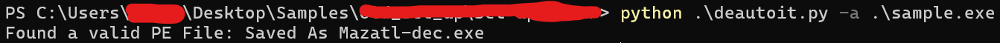
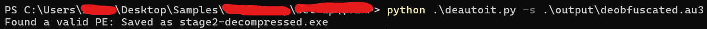

# deAutoIt
A handy tool that automatically extracts the next stage of malware using AutoIt that decodes the next stage via known patterns encountered during analyses.


```
usage: deautoit.py [-h] [-s SCRIPT] [-a AUTOIT]

A tool to automate extraction of stage 2 of some cases of malware using AutoIt.

options:
  -h, --help           show this help message and exit
  -s, --script SCRIPT  Work directly on the script (deobfuscate strings before using it)
  -a, --autoit AUTOIT  extract the script and embedded files then work on them
  ```

# Real World Examples:
### probably Purelog Stealer : sha256:1c78b60b0ea5b53fd95bc16b6d9a4421d8e9dc0e2e1b0eb4bcb9951afae45774
This samples uses AutoIt de deliver the next stage, the tool automatically extracts the next stage.


### Lumma Stealer : sha256:05a0e74cac490fe2e0e36aac9f1e439945ee024b08cfea7e779e358599a71398
This samples uses an AutoIt script at an advanced stage, the tool automatically extracts the next stage


